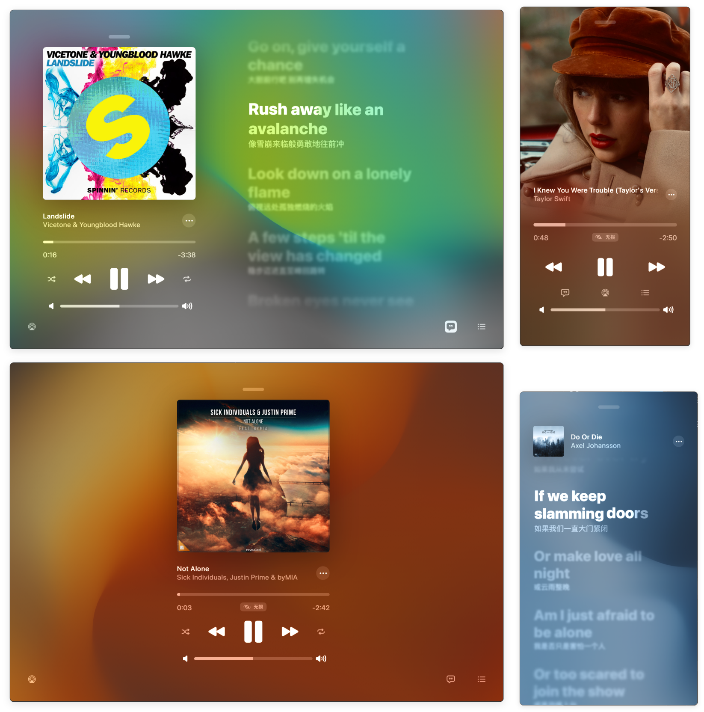

## 什么是 AMLL

Apple Music Like Lyrics，缩写为 AMLL，是一个 Apple Music 风格的开源前端逐字歌词展示库。

逐字歌词也称逐音节歌词，是指歌词的时间轴精确到音节（中文的字，或拼音文字中的音节），类似于卡拉 OK 样式。在展示时，歌词中的文本将随着音乐播放逐字亮起或出现。在网站的 [首页](/) 上有一个简单的 demo。下面是一些运行截图。

## 分发与使用

AMLL 以 npm 包的形式分发，提供了从展示组件、框架绑定到歌词处理的一系列工具：

- **组件相关**（浏览器端）
    - [@applemusic-like-lyrics/core](https://www.npmjs.com/package/@applemusic-like-lyrics/core)  
      AMLL 核心库，框架无关的逐字歌词与背景渲染组件
    - [@applemusic-like-lyrics/react](https://www.npmjs.com/package/@applemusic-like-lyrics/react)  
      核心库的 React 绑定
    - [@applemusic-like-lyrics/vue](https://www.npmjs.com/package/@applemusic-like-lyrics/vue)  
      核心库的 Vue 绑定
    - [@applemusic-like-lyrics/react-full](https://www.npmjs.com/package/@applemusic-like-lyrics/react-full)  
      开箱即用的完整播放器封装，包含进度条、封面、歌词、背景等，仅支持 React

- **外围工具**（浏览器与 Node 双端）
    - [@applemusic-like-lyrics/ttml](https://www.npmjs.com/package/@applemusic-like-lyrics/ttml)  
      TTML 逐字歌词格式的解析与生成库
    - [@applemusic-like-lyrics/lyric](https://www.npmjs.com/package/@applemusic-like-lyrics/lyric)  
      主流各歌词格式的解析与生成库，例如 LRC、YRC、LQE 等
    - [@applemusic-like-lyrics/fft](https://www.npmjs.com/package/@applemusic-like-lyrics/fft)  
      音频可视化模块，将音频波形数据转换成频谱
    - [@applemusic-like-lyrics/ws-protocol](https://www.npmjs.com/package/@applemusic-like-lyrics/ws-protocol)  
      歌词播放器协议库，用于同步播放进度和播放信息

AMLL **以 [GNU General Public License v3.0 only](https://spdx.org/licenses/GPL-3.0.html) 开放源代码**，仓库位于 [GitHub](https://github.com/amll-dev/applemusic-like-lyrics)。在遵守开源协议的前提下，你可以将其集成到你的项目中。

得益于前端技术栈的大规模应用与日趋成熟，网页渲染在浏览器、桌面端、移动端等平台上有着出色的一致性。如果你正在开发音乐播放器、卡拉 OK 等相关项目，并正在使用前端技术栈，AMLL 是一个不错的选择。

## 下一步

除了 AMLL 本身之外，以 AMLL 为中心还有一系列上下游生态项目，例如逐字歌词库、逐字歌词编辑器、第一方播放器等，你可以在 [生态](./eco) 中了解详情。

如果你想在项目中开始使用 AMLL，请转到 [快速开始](./quickstart)。
